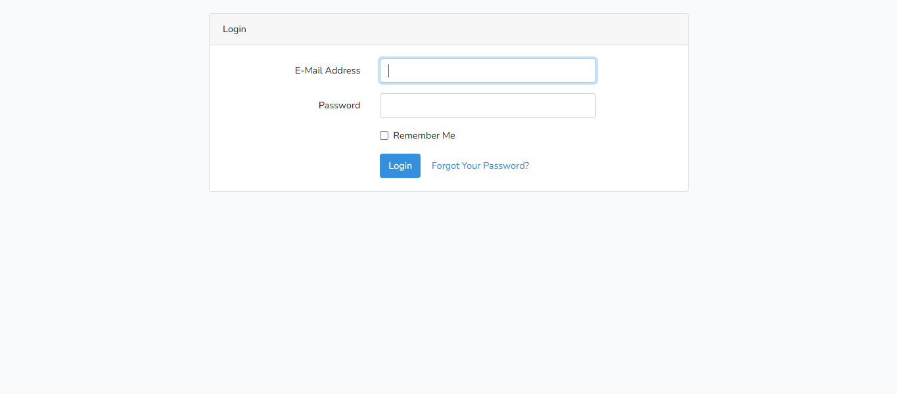
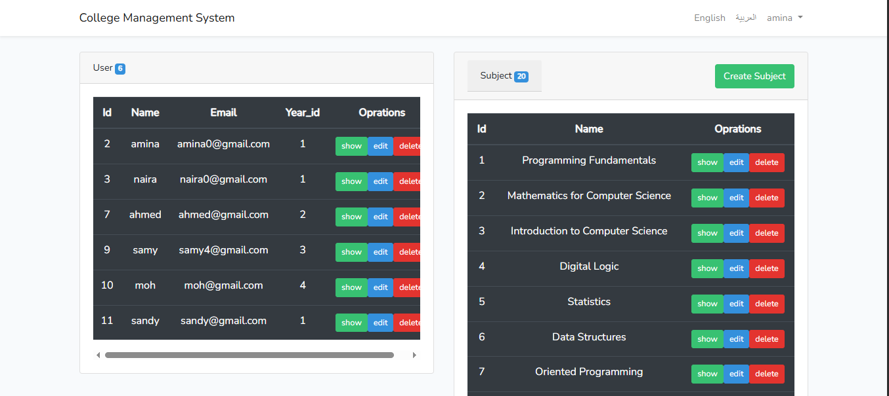
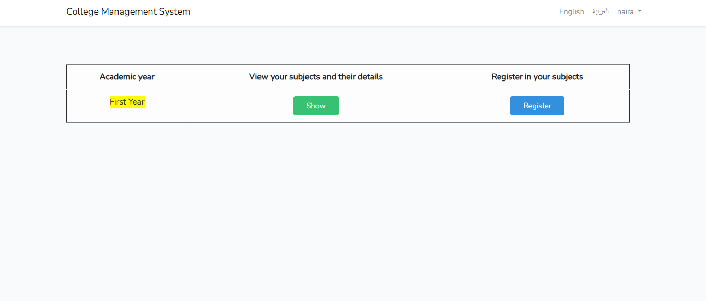
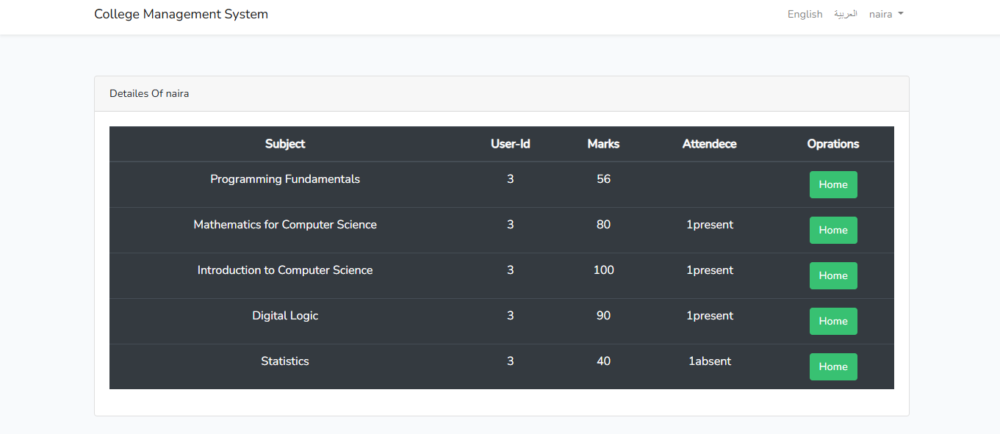

# College Management System

A web-based College Management System developed using Laravel 7.

## Features

### Authentication & Authorization

* Login using email and password.
* Role-based access control (Admin / Student).

### Student Features

* View enrolled subjects.
* Register for subjects.
* View grades and academic results.
* Track attendance records.

### Administrator Features

* Manage students, subjects, marks, and attendance.
* Full CRUD operations through the dashboard.

### REST API

* RESTful API endpoints for CRUD operations.
* API testing using Postman.

### Translation

* Multi-language support using Laravel Localization.

## Technologies Used

* Laravel 7
* PHP
* MySQL
* Bootstrap
* REST API
* Postman

## Screenshots

### Login Page

### Dashboard

### Subjects

### Attendance

